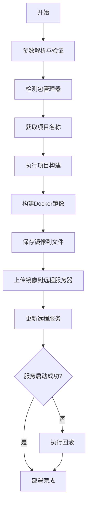

# Next.js 项目自动构建与部署系统设计文档

## 1. 系统架构

本系统采用 Bash 脚本实现，通过调用系统命令和工具来完成整个部署流程。系统主要分为以下几个模块：

1. 参数解析模块
2. 环境检测模块
3. 项目构建模块
4. Docker 镜像构建模块
5. 镜像传输模块
6. 远程服务更新模块
7. 回滚处理模块
8. 日志记录模块

## 2. 技术选型

- **主要语言**：Bash 脚本
- **依赖工具**：
  - Docker：用于构建和管理容器镜像
  - SSH/SCP：用于安全连接和文件传输
  - Docker Compose：用于服务编排
  - 包管理器（yarn/npm/pnpm）：用于项目构建

## 3. 详细设计

### 3.1 参数解析模块

负责解析和验证用户输入的命令行参数：
- 项目目录路径
- 项目名称（用于镜像命名）
- 构建命令
- 远程服务器信息
- 镜像目录和 Compose 目录路径
- 日志保存目录
- 配置文件路径

### 3.2 环境检测模块

- 检测项目使用的包管理器（通过检查 lock 文件）
- 验证必需的系统工具是否存在（Docker, SSH 等）
- 验证项目目录和必需文件（Dockerfile）是否存在

### 3.3 项目构建模块

- 进入项目目录
- 执行用户指定的构建命令
- 处理构建过程中的错误

### 3.4 Docker 镜像构建模块

- 使用项目中的 Dockerfile 构建镜像
- 镜像名称基于用户指定的项目名称或从 package.json/Dockerfile 目录名推断
- 为镜像添加时间戳标签以支持版本管理
- 验证镜像构建是否成功

### 3.5 镜像传输模块

- 将构建好的镜像保存为 tar 文件
- 通过 SCP 将镜像文件传输到远程服务器
- 在远程服务器创建必要的目录结构

### 3.6 远程服务更新模块

在远程服务器上执行以下操作：
- 停止当前运行的服务
- 卸载旧版本的镜像
- 加载新版本的镜像
- 启动服务
- 验证服务是否正常运行

### 3.8 日志记录模块

- 提供不同级别的日志输出（INFO, WARN, ERROR）
- 使用不同颜色区分日志级别
- 记录操作时间戳
- 可选地将日志保存到指定目录的文件中

### 3.9 配置文件处理模块

- 支持从配置文件加载部署参数
- 验证配置文件中必需参数的存在性
- 允许命令行参数覆盖配置文件中的设置
- 支持多个项目的灵活部署

## 4. 工作流程

## 5. 错误处理

- 在每个步骤中检测错误并适当退出
- 提供清晰的错误信息
- 在脚本退出时清理临时文件
- 新版本启动失败时自动回滚

## 6. 安全考虑

- 使用 SSH 密钥认证而非密码认证
- 限制远程服务器上的操作权限
- 清理传输过程中的临时文件

## 7. 性能优化

- 使用 Docker 镜像层缓存加速构建
- 仅传输必要的镜像文件
- 在远程服务器上并行执行停止和启动操作

## 8. 可扩展性

- 支持不同的包管理器
- 支持不同的 Docker 镜像仓库
- 可通过参数扩展支持更多功能